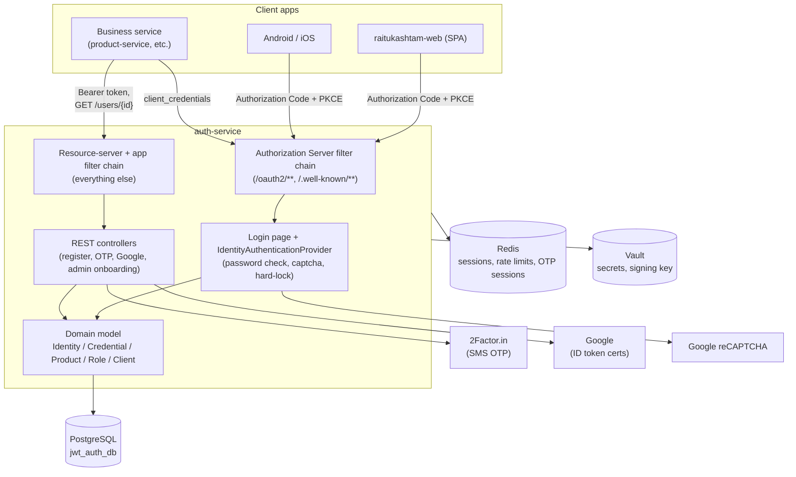
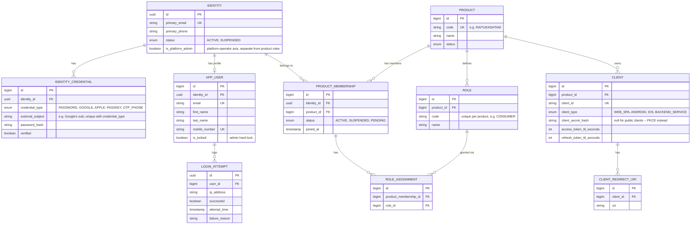
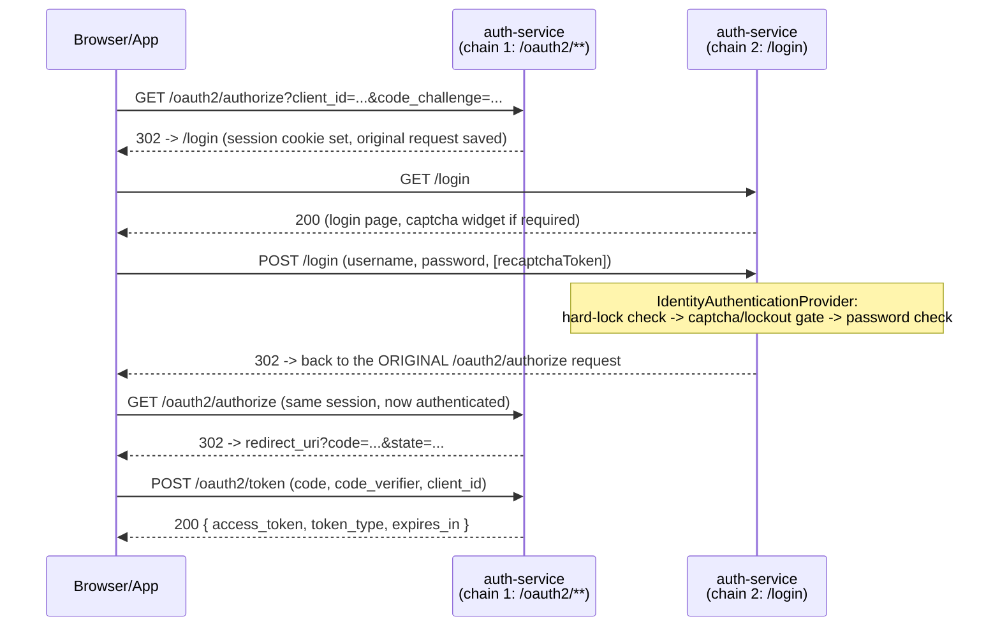

# auth-service

The identity and authorization platform for every product and client app
in the Raitukashtam ecosystem. It is a **platform service** (see the root
[`CLAUDE.md`](../../CLAUDE.md) for the platform-vs-domain split) — domain/
business services such as `product-service` in
[`raitukashtam-business`](https://github.com/harikrish438/raitukashtam-business)
never implement their own login, session, or user-record logic. They
authenticate against this service and consume the identity it asserts.

This document covers the service's architecture, its data model, every
authentication flow it implements, and — the main reason this file
exists — **how a new business service integrates with it.**

For the day-to-day API contract (request/response shapes, which
endpoints need what token), don't hand-maintain a copy here: run the
service and open **`/swagger-ui/index.html`**. It's generated live from
the code, grouped by audience (Business Service Integration /
Self-Service / Platform Admin), so it can't drift the way a written
description would. This README is the architecture and integration
story that the API surface alone doesn't explain.

## Contents

- [What this service owns](#what-this-service-owns)
- [Architecture](#architecture)
- [Data model](#data-model)
- [Authentication flows](#authentication-flows)
- [Onboarding a business service](#onboarding-a-business-service)
- [Configuration](#configuration)
- [Running locally](#running-locally)
- [Testing](#testing)
- [Observability](#observability)
- [Known limitations](#known-limitations)

## What this service owns

- **Who someone is** (`Identity`) and **how they prove it**
  (`IdentityCredential` — password, Google, phone OTP, ...), independent
  of any one product.
- **Which products a person belongs to** (`Product` /
  `ProductMembership`) and **what they're allowed to do in each one**, as
  opaque role strings (`Role` / `RoleAssignment`) — auth-service asserts
  role membership; it does not know or enforce what a role authorizes.
  That's each product's own concern.
- **Which client apps are allowed to ask for tokens** (`Client` /
  `ClientRedirectUri`) and via which OAuth2 grant.
- **Issuing and validating tokens** — a real OAuth2/OIDC Authorization
  Server (Spring Authorization Server), not a hand-rolled JWT
  implementation.
- **Abuse resistance** on every unauthenticated, human-facing endpoint —
  login lockout/captcha escalation, IP-keyed rate limiting on
  OTP/password-reset/Google-verify.

What it deliberately does **not** own: fine-grained permissions/policy
(each product's own services decide what a role can actually do),
product business data, and — as of the Phase 4 rewrite — it no longer
issues raw HMAC JWTs for anything except password-reset tokens; real
user/service tokens are RS256, signed via a JWKS endpoint any resource
server can validate against independently.

## Architecture

### High-level shape



### Two independent Spring Security filter chains

This is the single most important thing to understand about the code
structure, since it trips people up:

| | `AuthorizationServerConfig` (`@Order(1)`) | `SecurityConfig` (`@Order(2)`) |
|---|---|---|
| Matches | `/oauth2/**`, `/.well-known/**` | everything else |
| Purpose | Spring Authorization Server itself — `/oauth2/authorize`, `/oauth2/token`, `/oauth2/jwks` | the app's own REST API + the custom `/login` page |
| Auth mechanism | delegates to whichever principal is already in the session (or a client's own Basic-auth credentials for `client_credentials`) | `CaptchaAwareAuthenticationFilter` for `POST /login`; `oauth2ResourceServer().jwt()` (validates Bearer tokens via the same JWKS this service publishes) for everything else |

A login is a *conversation between the two chains*: a browser hits
`/oauth2/authorize` (chain 1) unauthenticated → redirected to `/login`
(chain 2, the custom login page) → credentials POSTed to `/login` (chain
2, `CaptchaAwareAuthenticationFilter` → `IdentityAuthenticationProvider`)
→ on success, the *same session* redirects back to the original
`/oauth2/authorize` request → chain 1 now sees an authenticated session
and issues a code. See [Authentication flows](#authentication-flows)
for the full sequence.

### Package layout

```
config/      Spring @Configuration classes: the two security filter
             chains, CORS, OpenAPI/Swagger, Redis, Eureka, data seeders
             (ProductDataSeeder / ClientDataSeeder / PlatformAdminSeeder,
             each with an explicit @Order — a fresh database would
             otherwise crash on ClientDataSeeder running before its
             product exists)
controller/  REST + the one @Controller (LoginPageController, the
             server-rendered login page — not a JSON API)
security/    Everything specific to the OAuth2/login mechanism:
             IdentityAuthenticationProvider (the real credential check),
             CaptchaAwareAuthenticationFilter/Token (the custom /login
             POST handler), JpaRegisteredClientRepository (backs Spring
             AS's client lookups with the Client/ClientRedirectUri
             tables directly), OAuth2TokenClaimsCustomizer (adds
             roles/platform_role claims), ReuseDetectingAuthorizationService
             (refresh-token reuse detection Spring AS doesn't provide out
             of the box), GoogleTokenVerifierService (isolates the one
             call out to Google's own verification library)
service/     Business logic: UserService, RoleService, ProductService,
             ClientService, OTPService, RateLimiterService, ...
entity/      JPA entities — see Data model below
repository/  Spring Data JPA repositories
request/
response/    API request/response DTOs (validation annotations live on
             the request DTOs)
dto/         A handful of older request DTOs from before the
             request/response split was consistently applied
jwt/         JwtTokenUtil (auth0 java-jwt directly) — password-reset
             tokens only; everything else moved to Spring AS/RS256 in
             Phase 4
exception/   Domain exceptions + GlobalExceptionHandler (the
             @ExceptionHandler → HTTP status mapping)
scheduler/   TokenCleanupTask — daily pruning of expired
             oauth2_authorization rows and old refresh-token-reuse
             ledger entries
util/        TokenHasher (SHA-256, used for the refresh-token reuse
             ledger — never store a raw token value at rest)
```

### Why this shape (the short version)

The service went through a deliberate multi-phase redesign from a
single-product, single-enum-role, HMAC-JWT service into the
multi-product platform described here — see
[`docs/design/multi-product-identity-platform.md`](docs/design/multi-product-identity-platform.md)
for the full rationale and phase-by-phase history if you want the "why"
behind a specific design choice (e.g. why roles are data instead of an
enum, why `Tenant` doesn't exist, why there are two Spring AS filter
chains). That document is the design record; this README is the
"how do I actually use/integrate with it" reference.

## Data model



Plus infrastructure tables not modeled as JPA entities directly:
`oauth2_authorization` / `oauth2_authorization_consent` (Spring
Authorization Server's own, JDBC-backed via `JpaRegisteredClientRepository`
+ a stock `JdbcOAuth2AuthorizationService` wrapped by
`ReuseDetectingAuthorizationService`), `refresh_token_ledger` (reuse
detection), `used_password_reset_token` (single-use enforcement for
password-reset tokens).

**Key relationships worth internalizing:**
- One `Identity` can have multiple `IdentityCredential` rows (password
  *and* Google, for the same person) and multiple `ProductMembership`
  rows (the same person in more than one product) — but this repo only
  ever seeds and uses one product (`RAITUKASHTAM`), so in practice
  today every identity has exactly one membership. The schema doesn't
  assume that; it's just the only case exercised so far.
- `Role`/`RoleAssignment` are **scoped per product** — the same role
  *code* string (`CONSUMER`) in two different products are two
  completely separate `Role` rows with no relationship to each other.
- `Identity.is_platform_admin` is a **separate axis** from product
  roles entirely — it's "can operate this auth-service instance itself"
  (onboard products, promote other admins), not a product-business
  permission. Don't conflate the two when reasoning about
  authorization.
- Schema is Flyway-managed (`src/main/resources/db/migration/`,
  currently `V1`–`V12`); `ddl-auto` is `validate` in every profile
  (including `dev`) — a schema change always needs a real migration
  file, never just an entity change.

## Authentication flows

### 1. Authorization Code + PKCE (web/mobile — the primary user login)



Public clients (`WEB_SPA`/`ANDROID`/`IOS`) use
`client_authentication_method: none` + mandatory PKCE (`ClientSettings.requireProofKey(true)`,
`JpaRegisteredClientRepository`) — no client secret, since one embedded
in an APK or JS bundle isn't a secret. **No consent screen**
(`requireAuthorizationConsent(false)`) and **no refresh token** for
these clients — a deliberate, accepted Spring Authorization Server
default (see the design doc's Phase 4 notes); access tokens are
short-lived only (`Client.access_token_ttl_seconds`, 3600s by default)
and the client re-runs this flow when one expires.

### 2. `client_credentials` (service-to-service — see [Onboarding a business service](#onboarding-a-business-service))

A single request/response, no browser involved: `POST /oauth2/token`
with HTTP Basic auth (`client_id`:`client_secret`) and
`grant_type=client_credentials`. No `Identity` is behind this kind of
token — `OAuth2TokenClaimsCustomizer` deliberately emits no
`roles`/`platform_role` claims for it.

### 3. Google Sign-In

`POST /google/verify-token` with a real Google ID token (obtained
client-side via Google Identity Services). `GoogleTokenVerifierService`
verifies it against Google's own certs; on success the identity is
created-or-linked (matched first by the Google `sub` via
`identity_credential.external_subject`, falling back to matching an
existing identity by email — refused with `403` if that existing
identity's email isn't Google-verified, to avoid silently taking over
an account via an unverified email claim) and the current session is
authenticated exactly the way a password `/login` would be. The
frontend then continues with the *same* `/oauth2/authorize` request it
already had in flight — Google Sign-In is a way to authenticate the
session, not a separate token-issuance path.

### 4. Password reset

`POST /forgot-password` (email in, always `200` regardless of whether
the email is registered — doesn't leak account existence) →
HMAC reset token, emailed → `POST /reset-password`
(token + new password) validates and consumes it. Single-use, enforced
via the `used_password_reset_token` ledger keyed by the token's `jti` —
replaying the same token returns `400`.

### 5. OTP (phone verification)

`POST /otp/generate` → delegates to 2Factor.in's own AUTOGEN session
flow; this service only ever holds an opaque session id (in Redis,
TTL'd), never the real code. `POST /otp/verify` forwards the caller's
guess to 2Factor's own VERIFY endpoint. Both endpoints are IP-rate-limited.

### Abuse resistance (applies across the login/OTP/reset/Google surface)

- **Captcha escalation**: after 3 failed login attempts within a 15-minute
  window (`security.login.*`), the next attempt requires a valid
  reCAPTCHA token before the password is even checked.
- **Rolling lockout**: at 5 failed attempts, the account is locked for
  30 minutes from the last failure — independent of, and checked before,
  the captcha gate.
- **Admin hard-lock**: `app_user.is_locked`, settable by a platform
  admin, takes precedence over everything else and has no time limit.
- **Rate limiting**: Redis-backed, IP-keyed, fixed-window, on every
  unauthenticated endpoint an attacker could hammer
  (`/otp/generate`, `/otp/verify`, `/forgot-password`, `/reset-password`,
  `/google/verify-token`).

## Onboarding a business service

This is the section to read if you're wiring a new domain/business
service (the way `product-service` in `raitukashtam-business` already
does) up to this platform. There are two separate integration
questions — **calling auth-service** and **trusting tokens auth-service
issued to someone else** — and they use different mechanisms.

### 1. Register your service as a Client

Every caller of auth-service — human client app or backend service —
needs a row in the `client` table, scoped to a `Product`. For a backend
service this means a `BACKEND_SERVICE`-type client with a generated
secret. Register one via the Platform Admin API (needs a
`PLATFORM_ADMIN` bearer token — see Swagger's "Platform Admin" group for
`POST /products/{code}/clients`):

```sh
curl -X POST https://auth.example.com/products/RAITUKASHTAM/clients \
  -H "Authorization: Bearer $PLATFORM_ADMIN_TOKEN" \
  -H "Content-Type: application/json" \
  -d '{
        "clientId": "product-service",
        "clientType": "BACKEND_SERVICE"
      }'
```

The response includes a **one-time plaintext `clientSecret`** — it's
never recoverable after this call (only the bcrypt hash is stored).
Save it into your service's own secret store immediately.

(In dev, a `BACKEND_SERVICE` client called `raitukashtam-backend-test`
is already seeded by `ClientDataSeeder` for local testing — its secret
is logged once at first boot, also unrecoverable after that.)

### 2. Get a token for calling auth-service yourself

Standard OAuth2 `client_credentials`, HTTP Basic auth:

```sh
curl -u 'product-service:<clientSecret>' \
  -d 'grant_type=client_credentials' \
  https://auth.example.com/oauth2/token
```

```json
{ "access_token": "eyJ...", "token_type": "Bearer", "expires_in": 3600 }
```

### 3. Call the endpoints meant for business-service consumption

Right now that's **`GET /users/{id}`** — resolve a user id you already
have (e.g. from a product record's "owner" field) into a display
name/email. It requires any valid Bearer token (this `client_credentials`
one, or a real user's own token) — not `PLATFORM_ADMIN`:

```sh
curl -H "Authorization: Bearer $TOKEN" \
  https://auth.example.com/users/42
```

Check Swagger's **Business Service Integration** group for the current,
authoritative list — it's the one group specifically curated for this
audience, and will grow as more integration needs come up. If you need
an endpoint that isn't there yet, that's a real gap to raise, not
something to work around by calling a `Platform Admin` endpoint with a
borrowed admin token.

### 4. Validate tokens *your* service receives from end-users

This is the more common integration shape: your service's own API gets
called directly by a frontend, carrying an access token auth-service
issued during that user's login (flow 1 above) — your service needs to
validate it **itself**, not by calling back into auth-service on every
request.

Since tokens are RS256-signed, this is standard OAuth2 resource-server
validation against auth-service's published JWKS:

```
GET /oauth2/jwks
```

Any standard JWT/OAuth2 resource-server library (Spring's own
`spring-boot-starter-oauth2-resource-server`, if your service is also
Spring; equivalent libraries exist for every stack) can be pointed at
this URL and will fetch/cache the key set and validate signatures
without ever calling auth-service per-request. For a Spring service:

```yaml
spring:
  security:
    oauth2:
      resourceserver:
        jwt:
          jwk-set-uri: https://auth.example.com/oauth2/jwks
```

**Claims your service can rely on** (see `OAuth2TokenClaimsCustomizer`):

| Claim | Present when | Meaning |
|---|---|---|
| `sub` | always | the `Identity` UUID — stable identifier, never an email |
| `iss` | always | this service's base URL (the OAuth2 issuer) |
| `aud` | always | the calling client's `client_id` |
| `roles` | user-issued tokens only (not `client_credentials`) | array of role codes, **scoped to the requesting client's own `Product`** — a token issued to a `raitukashtam-web` login only carries roles from the `RAITUKASHTAM` product |
| `platform_role` | only if the identity is a platform admin | literal string `PLATFORM_ADMIN` — this is *not* a product role, don't treat it as one |

**What NOT to assume**: there is no `email` or `name` claim in the
token itself (by design — claims are kept minimal and roles are
product-scoped). If your service needs a user's profile info, call
`GET /users/{id}` (step 3) using the `sub` claim, or maintain your own
copy synced some other way — don't expect auth-service to embed PII in
every token.

### 5. If your product needs its own roles

Roles are product-scoped data, not shared across products. Register
them the same way clients are registered — `POST /products/{code}/roles`
(Platform Admin API) — under your product's own code, not
`RAITUKASHTAM`'s. If your service is a genuinely separate product (not
a module of the existing `RAITUKASHTAM` product), register the product
itself first (`POST /products`) before its clients/roles.

## Configuration

Full environment-variable reference lives in the root
[`CLAUDE.md`](../../CLAUDE.md#key-environment-variables-set-in-docker-compose)
and this service's own `.env*.example` files/`application-*.yml`
profiles — not duplicated here since those are the actual source of
truth and this file would just drift. The short version: `dev` runs
with Vault optional and checked-in dummy defaults; `test`/`prod` require
Vault for real secrets (DB/Redis passwords, JWT signing key, mail/
reCAPTCHA/2Factor credentials) and fail to start without it.

One property worth calling out specifically since it's easy to get
wrong when integrating a new client: `app.base-url` is the OAuth2
**issuer** (`iss` claim, and the base every relative URL in the
Authorization Server's own metadata is resolved against). It must
match the actual public origin the service is reached at in that
environment — a mismatch here breaks token validation for any resource
server checking `iss`, not just this service's own login flow.

## Running locally

See the root [`CLAUDE.md`](../../CLAUDE.md#running-docker-compose) for
the full platform-stack startup sequence — this service depends on
Postgres, Redis, Vault (optional in dev), Eureka, and Config Server all
being reachable, and doesn't have a meaningful standalone local-only
mode. Short version:

```sh
docker compose up -d          # from the repo root — brings up the whole platform stack
```

auth-service listens on `:8080` (debug port `5006`). Once up:
`http://localhost:8080/swagger-ui/index.html` for the API,
`http://localhost:8080/actuator/health` for a liveness check.

## Testing

`src/test/java/com/raitukashtam/auth/` has a real integration test
suite — 75 tests across 9 classes, exercising every custom endpoint's
success/validation/auth/business-rule scenarios plus the OAuth2
mechanics directly (PKCE login, captcha escalation, lockout,
`client_credentials`, JWKS, refresh-token absence for public clients).

It's genuinely self-contained: Testcontainers spins up real Postgres +
Redis, WireMock intercepts the two real external calls this service
makes (2Factor, reCAPTCHA), and the whole suite runs against a real
Authorization Code + PKCE flow driven over actual HTTP — no Vault, no
config server, no dependency beyond a working Docker daemon.

```sh
mvn test
```

`src/test/java/.../support/` has the reusable pieces if you're adding
new tests: `AbstractIntegrationTest` (the shared Testcontainers/WireMock
setup), `PkceFlowClient` (drives a real login end-to-end and returns a
token), `TestDataFactory` (registers real users/admins/backend-service
clients via the same code paths the real endpoints use), `WireMockStubs`
(canned 2Factor/reCAPTCHA responses).

## Observability

- **Tracing**: Micrometer → Zipkin, 100% sampling in dev/test, 10% in
  prod (`management.tracing.sampling.probability`).
- **Logging**: colored console in `dev`; structured JSON
  (Logstash-compatible) in `test`/`prod` (`logback-spring.xml`).
- **Health**: `/actuator/health` — includes DB, disk space, and (where
  relevant) Vault connectivity; Redis/mail health checks are
  deliberately disabled (`management.health.redis.enabled: false` etc.)
  since a Redis/mail hiccup shouldn't flip the whole service unhealthy.
  `management.endpoint.health.show-details: always` is set in the base
  `application.yml` and **not overridden in `prod`** — component-level
  detail (e.g. which check failed) is visible on `/actuator/health` in
  every environment, not just dev/test. Actuator's exposed endpoint set
  is narrower in prod (`health,info` only, vs. `health,info,metrics`
  elsewhere), but that doesn't change what `show-details` reveals on
  `health` itself. Worth tightening if that level of detail shouldn't
  be public once prod is internet-facing — not fixed here, just flagged
  accurately rather than assumed away.

## Known limitations

- **No refresh tokens for public (web/mobile) clients** — an accepted
  Spring Authorization Server default, not a bug. Access tokens are
  short-lived only; the client re-authenticates via the full flow when
  one expires. `ReuseDetectingAuthorizationService` is built and correct
  but currently has nothing to protect until a confidential client with
  refresh tokens exists.
- **The full `PLATFORM_ADMIN`-gated surface is just `GET /users`,
  `PATCH /users/{id}/platform-admin`, and product/client/role
  onboarding** — there's no broader admin console; onboarding a new
  product is entirely API-driven (see
  [Onboarding a business service](#onboarding-a-business-service)).
- **Only one product (`RAITUKASHTAM`) is actually onboarded today** —
  the multi-product schema is real and tested (see
  `ProductControllerApiTest`, `ClientControllerApiTest`), but no second
  product exists yet in any environment.
- **HMAC JWTs (`jwt/JwtTokenUtil.java`) are only used for password-reset
  tokens** — everything else moved to Spring AS/RS256/JWKS in Phase 4. If
  you're looking for where access tokens get signed, it's
  `AuthorizationServerConfig`/the JWKS endpoint. There is no separate
  `jwt-library` module in this repo (removed 2026-08-25) — the
  password-reset HMAC logic is inlined directly here via
  `com.auth0:java-jwt`.
- Full list of open items, with more operational/deployment detail:
  see `docs/design/multi-product-identity-platform.md` and this
  project's own memory/known-issues tracking (not part of this repo).
